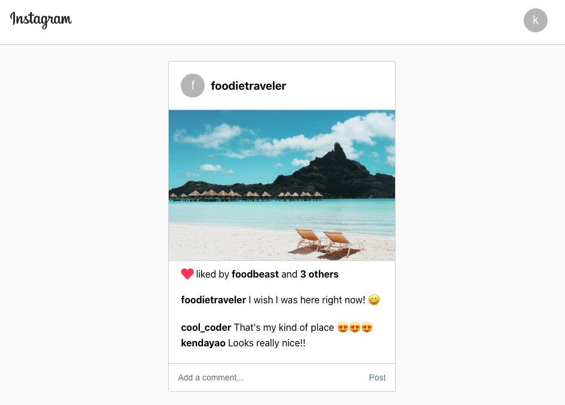

# Instagram-Clone

## Description

This application is a replica of the popular social media platform, Instagram. It is built using React.js, Material UI for styling, redux and react hooks to manage state, and firebase for data storage and web hosting. Users are able to sign up, post photos, write comments, and like individual posts.

## Table of Contents

- [Description](#description)
- [Technology](#technology)
- [User Story](#user-story)
- [Installation](#installation)
- [Usage](#usage)
- [License](#license)
- [Contributing](#contributing)
- [Tests](#tests)
- [Questions](#questions)
- [Deployed Application URL](#deployed-application-URL)

## Technology

- React.js
- Firebase
- React Hooks
- Redux
- Material UI
- CSS
- HTML

## User Story

## Installation

npm install any dependencies

## Usage

The deployed link will take you to the homepage. On the homepage, click on sign up to create and account or sign in to log in an existing account. You can log using the credentials below. Once logged in, you can click on the heart icon to like a photo, input on the comment field to comment on a photo, and click on the add photo button from the top dropdown menu to add your own photo.

Public Login Credentials

- email: cool_coder@email.com
- password: 12341234

## License

## Contributing

Please follow standard contributing guidelines.

## Tests

No tests to run.

## Questions

For any questions, please contact kendayao at kendayao@gmail.com

## Deployed Application URL

Deployed application link: https://instagram-clone-bf736.web.app/

